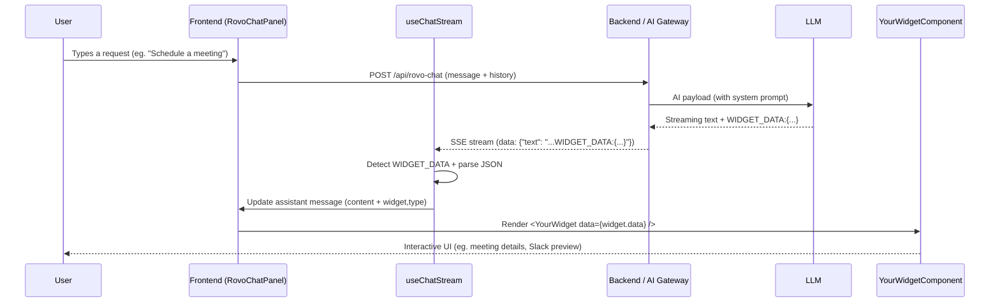

# Building New Chat Widgets (Template Guide)

This guide explains how to add **new widget types** to the Rovo chat experience, using the existing **Work Items widget** as a reference. You can use the same pattern to build widgets like:

- "Send a Slack message" widget  
- "Schedule a meeting" widget  
- "Create Jira issue" widget  
- "Summarize Confluence page" widget  

The key idea:

> The model emits a **special `WIDGET_DATA:` JSON block** in the streamed response; the frontend parses that and renders a **React widget component** instead of plain text.

---

## 1. End‑to‑End Widget Flow



---

## 2. Core Concepts & Contracts

All widgets follow the same basic contract:

### 2.1 Model Output Format

```text
[1–2 sentences of normal assistant text]
WIDGET_DATA:{"type":"<widget-type>","data":{ ... widget-specific payload ... }}
```

- `type`: a **string** identifying your widget (e.g. `"work-items"`, `"slack-message"`, `"schedule-meeting"`).
- `data`: a **JSON object** whose shape you define for your widget.

### 2.2 Message Shape in Frontend

[`RovoChatContext`](../app/contexts/RovoChatContext.tsx) defines:

```ts
interface Message {
  // ...
  widget?: {
    type: string;
    data: any; // widget-specific payload
  };
  widgetLoading?: boolean;
}
```

### 2.3 Streaming Parser Responsibilities

[`useChatStream`](../app/hooks/useChatStream.ts) is responsible for:

- Listening for **`WIDGET_DATA:`** in the streamed text.
- Extracting the JSON payload via regex: `WIDGET_DATA:({[\s\S]*})`.
- Setting `message.widget = { type, data }` and `widgetLoading` flags.

### 2.4 Renderer Responsibilities

[`RovoChatPanel`](../app/components/RovoChatPanel.tsx) decides **which widget component** to render based on `message.widget.type`.

---

## 3. Step‑By‑Step: Adding a New Widget Type

Use this as a checklist/template for each new widget.

### Step 1: Choose a Widget Type & Data Schema

Decide:

- A unique **type string** (lowercase, kebab‑case recommended).
- A **data payload** structure that your React widget will need.

#### Example: Slack Message Widget

```jsonc
// Widget type string
"type": "slack-message"

// Suggested data schema
{
  "channel": "#team-chat",
  "previewText": "Draft message text...",
  "sender": "Ee Venn Soh",
  "timestamp": "2025-11-28T10:15:00Z",
  "actions": {
    "sendUrl": "https://slack.com/...",     // optional
    "editUrl": "https://slack.com/..."      // optional
  }
}
```

#### Example: Schedule Meeting Widget

```jsonc
"type": "schedule-meeting"

{
  "title": "Design review with Platform team",
  "date": "2025-12-01",
  "time": "15:00–16:00",
  "timeZone": "Pacific/Auckland",
  "attendees": [
    { "name": "Alice Wong", "email": "alice@example.com" },
    { "name": "Bob Lee", "email": "bob@example.com" }
  ],
  "location": "Zoom",
  "description": "Review latest design mocks and open risks.",
  "actions": {
    "createEventUrl": "https://calendar.google.com/...",
    "viewCalendarUrl": "https://calendar.google.com/..."
  }
}
```

#### Schema Template (fill this in per widget)

```md
**Widget type:** "<my-widget-type>"

**When to use:**
- [user-intent-1]
- [user-intent-2]
- [user-intent-3]

**Data schema (JSON):**
{
  "field1": "description...",
  "field2": ["..."],
  "fieldN": { "...": "..." }
}
```

---

### Step 2: Define the React Component for the Widget

Create a new component in `app/components/`, e.g.:

```tsx
// app/components/SlackMessageWidget.tsx
"use client";

import React from "react";
import { token } from "@atlaskit/tokens";
// import @atlaskit components as needed

interface SlackMessageWidgetData {
  channel: string;
  previewText: string;
  sender: string;
  timestamp?: string;
  actions?: {
    sendUrl?: string;
    editUrl?: string;
  };
}

interface SlackMessageWidgetProps {
  data: SlackMessageWidgetData;
}

export default function SlackMessageWidget({ data }: SlackMessageWidgetProps) {
  if (!data) {
    return (
      <div style={{ padding: token("space.100"), color: token("color.text.danger") }}>
        Error: Invalid Slack widget data
      </div>
    );
  }

  // Render contextual UI (channel, preview, actions, etc.)
  return (
    <div
      style={{
        backgroundColor: token("elevation.surface"),
        borderRadius: token("radius.medium"),
        boxShadow: token("elevation.raised"),
        padding: token("space.100"),
      }}
    >
      {/* ... */}
    </div>
  );
}
```

Follow the **WorkItemsWidget** pattern:

- Validate `data` and show a clear error when invalid.
- Use ADS tokens/components (no hardcoded styling where tokens exist).
- Design for a **compact, card‑like** UI inside a chat bubble.

---

### Step 3: Wire the Widget into the Chat Renderer

Open [`RovoChatPanel.tsx`](../app/components/RovoChatPanel.tsx) and locate where assistant messages render widgets:

```tsx
{message.widgetLoading && <LoadingWidget widgetType={message.widget?.type} />}

{message.widget && !message.widgetLoading && (
  <>
    {message.widget.type === "work-items" && <WorkItemsWidget data={message.widget.data} />}
  </>
)}
```

Extend this block for your new types:

```tsx
import SlackMessageWidget from "./SlackMessageWidget";
import ScheduleMeetingWidget from "./ScheduleMeetingWidget";

// ...

{message.widget && !message.widgetLoading && (
  <>
    {message.widget.type === "work-items" && (
      <WorkItemsWidget data={message.widget.data} />
    )}
    {message.widget.type === "slack-message" && (
      <SlackMessageWidget data={message.widget.data} />
    )}
    {message.widget.type === "schedule-meeting" && (
      <ScheduleMeetingWidget data={message.widget.data} />
    )}
    {/* Template: add more widget types here */}
  </>
)}
```

Optionally, improve `LoadingWidget` to special‑case your types:

```tsx
function LoadingWidget({ widgetType }: { widgetType?: string }) {
  const getMessage = () => {
    if (widgetType === "work-items") return "Loading work items...";
    if (widgetType === "slack-message") return "Preparing Slack message...";
    if (widgetType === "schedule-meeting") return "Gathering meeting details...";
    return "Loading widget...";
  };

  // ...
}
```

---

### Step 4: Instruct the Model (System Prompt)

Open [`rovo/config.js`](../rovo/config.js) and update `buildSystemPrompt` to describe:

1. Your **new widget type**.
2. **When** to use it (user intent).
3. The **exact `WIDGET_DATA` JSON format**.

Use the template below to keep the wording consistent across widget definitions:

```text
**<Widget Name> Widget** - Use when the user asks for <outcome/intent summary>
- "<Intent example 1>"
- "<Intent example 2>"
- "<Intent example 3>"

If you detect the user wants <WIDGET NAME> assistance, respond in this format:
- Write 1–2 sentences of narrative context
- Then immediately output:
  WIDGET_DATA:{"type":"<widget-type>","data":{ ...structured payload... }}
```

After filling in the template, add any concrete variants you need. For instance:

```text
**Slack Message Widget** - Use when the user wants to draft, review, or send a Slack message to a person or channel. Example intents:
- "Draft a Slack message to my team about the outage"
- "Help me write a Slack update for #design"
- "What should I say in Slack to announce this?"

**Schedule Meeting Widget** - Use when the user wants to plan or schedule a meeting. Example intents:
- "Schedule a design review with the Platform team next week"
- "Set up a 30-minute 1:1 with Alex tomorrow afternoon"
- "Plan a project kickoff meeting for next Monday"
```

Then, tailor the `WIDGET_DATA` instructions for each widget’s schema.

#### Slack Message Widget format example

```text
If you detect the user wants SLACK MESSAGE assistance, respond in this format:
- Write 1–2 sentences introducing the draft message and context
- Then immediately output:
  WIDGET_DATA:{"type":"slack-message","data":{
    "channel":"#team-channel-or-@person",
    "previewText":"<the Slack message you recommend sending>",
    "sender":"${ROVO_CONFIG.userName}",
    "timestamp":"<ISO 8601 timestamp>",
    "actions":{
      "sendUrl":"<optional deep link to send the message in Slack>",
      "editUrl":"<optional deep link to edit the draft>"
    }
  }}
```

#### Schedule Meeting Widget format example

```text
If you detect the user wants MEETING SCHEDULING, respond in this format:
- Write 1–2 sentences summarizing the proposed meeting
- Then immediately output:
  WIDGET_DATA:{"type":"schedule-meeting","data":{
    "title":"<meeting title>",
    "date":"<YYYY-MM-DD>",
    "time":"<time or time range>",
    "timeZone":"<IANA timezone string>",
    "attendees":[
      {"name":"<name>","email":"<email>"},
      {"name":"<name>","email":"<email>"}
    ],
    "location":"<Zoom/Teams/Room name>",
    "description":"<short description>",
    "actions":{
      "createEventUrl":"<deep link to calendar>",
      "viewCalendarUrl":"<optional link>"
    }
  }}
```

**Important constraints to keep:**

- `WIDGET_DATA:` must be **on its own line**, directly after the intro sentences.
- No bullet points or extra text between the intro and `WIDGET_DATA` line.
- The JSON must be **valid** and **parseable** by `JSON.parse` on the frontend.

---

### Step 5: (Optional) Use `WIDGET_LOADING` Signals

`useChatStream` also understands a **loading signal**:

```text
WIDGET_LOADING:<widget-type>
```

If the model outputs this early in the stream, the hook will:

- Set `message.widgetLoading = true`.
- Set `message.widget = { type: "<widget-type>", data: null }`.

This allows you to:

- Show skeleton / loading states **before** full `WIDGET_DATA` arrives.
- Give the user instant feedback that a widget is coming.

You can document this in the system prompt, e.g.:

```text
For long-running operations (e.g., querying calendars or external systems),
you MAY first output a loading marker on its own line:

WIDGET_LOADING:schedule-meeting

and then continue your normal response and WIDGET_DATA line afterwards.
```

---

### Step 6: Test the New Widget

1. Start the app and backend.
2. Open the Rovo chat UI.
3. Type prompts that should trigger your widget, based on the system prompt instructions, for example:
   - `"Draft a Slack message to #team about today's release"`
   - `"Schedule a 30 min meeting with the platform team next Tuesday at 3pm"`
4. Confirm:
   - The **text intro** appears correctly.
   - The **widget card** appears with the right type and data.
   - Loading states behave as expected (if you use `WIDGET_LOADING`).
   - Error states (missing/invalid `data`) are handled gracefully in the component.

---

## 4. Reusable Template Snippet

Use this as a copy‑paste template when adding any new widget:

```md
## <Widget Name> Widget

**Widget type:** "<widget-type>"

**When to use:**
- [user-intent-1]
- [user-intent-2]
- [user-intent-3]

**Model output format:**

[1–2 sentences of explanation/context]
WIDGET_DATA:{"type":"<widget-type>","data":{
  "field1":"...",
  "field2":["..."],
  "fieldN":{ "...": "..." }
}}

**React component:**
- File: `app/components/<WidgetName>Widget.tsx`
- Props: `{ data: <YourWidgetDataInterface> }`
- Responsibilities:
  - Validate `data` and show a clear error if invalid.
  - Render a compact card using ADS components and tokens.
  - Optionally expose buttons/links to take follow‑up actions.

**Renderer integration:**
- Update `RovoChatPanel`:
  ```tsx
  {message.widget.type === "<widget-type>" && (
    <<WidgetName>Widget data={message.widget.data} />
  )}
  ```

**Loading behavior (optional):**
- Watch for `WIDGET_LOADING:<widget-type>` and show a loader in `LoadingWidget`.
```
